# Planetary Industry dependency schema

Schema delle dipendenze delle commodity di EVE Online, da P0 a P4.

- **P0**: risorse estratte dagli Extractor Control Units.
- **P1**: prodotti base, ottenuti in una Basic Industry Facility.
- **P2**: prodotti raffinati, ottenuti in una Advanced Industry Facility.
- **P3**: prodotti specializzati, ottenuti in una Advanced Industry Facility.
- **P4**: prodotti avanzati, ottenuti in una High-Tech Production Plant.

## Schema completo

```mermaid
flowchart LR
    subgraph P0["P0 - Raw resources"]
        microorganisms[Microorganisms]
        carbon[Carbon Compounds]
        planktic[Planktic Colonies]
        crystals[Non-CS Crystals]
        ionic[Ionic Solutions]
        autotrophs[Autotrophs]
        reactiveGas[Reactive Gas]
        nobleGas[Noble Gas]
        plasma[Suspended Plasma]
        nobleMetals[Noble Metals]
        complex[Complex Organisms]
        baseMetals[Base Metals]
        magma[Felsic Magma]
        heavyMetals[Heavy Metals]
        aqueous[Aqueous Liquids]
    end

    subgraph P1["P1 - Processed materials"]
        bacteria[Bacteria]
        biofuels[Biofuels]
        biomass[Biomass]
        chiral[Chiral Structures]
        electrolytes[Electrolytes]
        fibers[Industrial Fibers]
        oxidizing[Oxidizing Compound]
        oxygen[Oxygen]
        plasmoids[Plasmoids]
        precious[Precious Metals]
        proteins[Proteins]
        reactive[Reactive Metals]
        silicon[Silicon]
        toxic[Toxic Metals]
        water[Water]
    end

    subgraph P2["P2 - Refined commodities"]
        biocells[Biocells]
        construction[Construction Blocks]
        consumer[Consumer Electronics]
        coolant[Coolant]
        uranium[Enriched Uranium]
        fertilizer[Fertilizer]
        gelLivestock[Genetically Enhanced Livestock]
        livestock[Livestock]
        mechanical[Mechanical Parts]
        microfiber[Microfiber Shielding]
        miniature[Miniature Electronics]
        nanites[Nanites]
        oxides[Oxides]
        polyaramids[Polyaramids]
        polytextiles[Polytextiles]
        rocket[Rocket Fuel]
        glass[Silicate Glass]
        superconductors[Superconductors]
        supertensile[Supertensile Plastics]
        syntheticOil[Synthetic Oil]
        testCultures[Test Cultures]
        transmitter[Transmitter]
        viral[Viral Agent]
        cpu[Water-Cooled CPU]
    end

    subgraph P3["P3 - Specialized commodities"]
        biotech[Biotech Research Reports]
        camera[Camera Drones]
        condensates[Condensates]
        cryo[Cryoprotectant Solution]
        dataChips[Data Chips]
        gelMatrix[Gel-Matrix Biopaste]
        guidance[Guidance Systems]
        hazmat[Hazmat Detection Systems]
        hermetic[Hermetic Membranes]
        highTech[High-Tech Transmitters]
        explosives[Industrial Explosives]
        neocoms[Neocoms]
        reactors[Nuclear Reactors]
        vehicles[Planetary Vehicles]
        robotics[Robotics]
        smartfab[Smartfab Units]
        supercomputers[Supercomputers]
        synapses[Synthetic Synapses]
        transcranial[Transcranial Microcontrollers]
        ukomi[Ukomi Superconductors]
        vaccines[Vaccines]
    end

    subgraph P4["P4 - Advanced commodities"]
        broadcast[Broadcast Node]
        drones[Integrity Response Drones]
        nano[Nano-Factory]
        mortar[Organic Mortar Applicators]
        recursive[Recursive Computing Module]
        powerCore[Self-Harmonizing Power Core]
        conduits[Sterile Conduits]
        wetware[Wetware Mainframe]
    end

    microorganisms --> bacteria
    carbon --> biofuels
    planktic --> biomass
    crystals --> chiral
    ionic --> electrolytes
    autotrophs --> fibers
    reactiveGas --> oxidizing
    nobleGas --> oxygen
    plasma --> plasmoids
    nobleMetals --> precious
    complex --> proteins
    baseMetals --> reactive
    magma --> silicon
    heavyMetals --> toxic
    aqueous --> water

    precious --> biocells
    biofuels --> biocells
    toxic --> construction
    reactive --> construction
    chiral --> consumer
    toxic --> consumer
    water --> coolant
    electrolytes --> coolant
    toxic --> uranium
    precious --> uranium
    proteins --> fertilizer
    bacteria --> fertilizer
    biomass --> gelLivestock
    proteins --> gelLivestock
    biofuels --> livestock
    proteins --> livestock
    precious --> mechanical
    reactive --> mechanical
    silicon --> microfiber
    fibers --> microfiber
    silicon --> miniature
    chiral --> miniature
    reactive --> nanites
    bacteria --> nanites
    oxygen --> oxides
    oxidizing --> oxides
    fibers --> polyaramids
    oxidizing --> polyaramids
    fibers --> polytextiles
    biofuels --> polytextiles
    electrolytes --> rocket
    plasmoids --> rocket
    silicon --> glass
    oxidizing --> glass
    water --> superconductors
    plasmoids --> superconductors
    oxygen --> supertensile
    biomass --> supertensile
    oxygen --> syntheticOil
    electrolytes --> syntheticOil
    water --> testCultures
    bacteria --> testCultures
    chiral --> transmitter
    plasmoids --> transmitter
    biomass --> viral
    bacteria --> viral
    water --> cpu
    reactive --> cpu

    nanites --> biotech
    livestock --> biotech
    construction --> biotech
    glass --> camera
    rocket --> camera
    oxides --> condensates
    coolant --> condensates
    testCultures --> cryo
    syntheticOil --> cryo
    fertilizer --> cryo
    supertensile --> dataChips
    microfiber --> dataChips
    oxides --> gelMatrix
    biocells --> gelMatrix
    superconductors --> gelMatrix
    cpu --> guidance
    transmitter --> guidance
    polytextiles --> hazmat
    viral --> hazmat
    transmitter --> hazmat
    polyaramids --> hermetic
    gelLivestock --> hermetic
    polyaramids --> highTech
    transmitter --> highTech
    fertilizer --> explosives
    polytextiles --> explosives
    biocells --> neocoms
    glass --> neocoms
    microfiber --> reactors
    uranium --> reactors
    supertensile --> vehicles
    mechanical --> vehicles
    miniature --> vehicles
    mechanical --> robotics
    consumer --> robotics
    construction --> smartfab
    miniature --> smartfab
    cpu --> supercomputers
    coolant --> supercomputers
    consumer --> supercomputers
    supertensile --> synapses
    testCultures --> synapses
    biocells --> transcranial
    nanites --> transcranial
    syntheticOil --> ukomi
    superconductors --> ukomi
    livestock --> vaccines
    viral --> vaccines

    neocoms --> broadcast
    dataChips --> broadcast
    highTech --> broadcast
    gelMatrix --> drones
    hazmat --> drones
    vehicles --> drones
    explosives --> nano
    ukomi --> nano
    reactive --> nano
    condensates --> mortar
    robotics --> mortar
    bacteria --> mortar
    synapses --> recursive
    guidance --> recursive
    transcranial --> recursive
    camera --> powerCore
    reactors --> powerCore
    hermetic --> powerCore
    smartfab --> conduits
    vaccines --> conduits
    water --> conduits
    supercomputers --> wetware
    biotech --> wetware
    cryo --> wetware
```

Le frecce indicano gli input della ricetta, non una quantità specifica. Alcune ricette P4 usano due prodotti P3 e un prodotto P1; per questo, ad esempio, `Reactive Metals`, `Bacteria` e `Water` possono collegarsi direttamente a un prodotto P4.

## Pianeti da cui ottenere i P0

| P0 | Pianeti |
| --- | --- |
| Microorganisms | Barren, Ice, Oceanic, Temperate |
| Carbon Compounds | Barren, Oceanic, Temperate |
| Planktic Colonies | Ice, Oceanic |
| Non-CS Crystals | Lava, Plasma |
| Ionic Solutions | Gas, Storm |
| Autotrophs | Temperate |
| Reactive Gas | Gas |
| Noble Gas | Gas, Ice, Storm |
| Suspended Plasma | Lava, Plasma, Storm |
| Noble Metals | Barren, Plasma |
| Complex Organisms | Oceanic, Temperate |
| Base Metals | Barren, Gas, Lava, Plasma, Storm |
| Felsic Magma | Lava |
| Heavy Metals | Ice, Lava, Plasma |
| Aqueous Liquids | Barren, Gas, Ice, Oceanic, Storm, Temperate |
